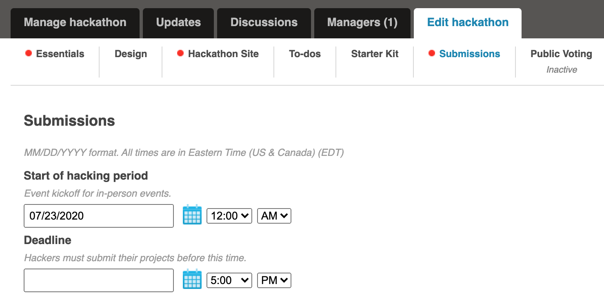
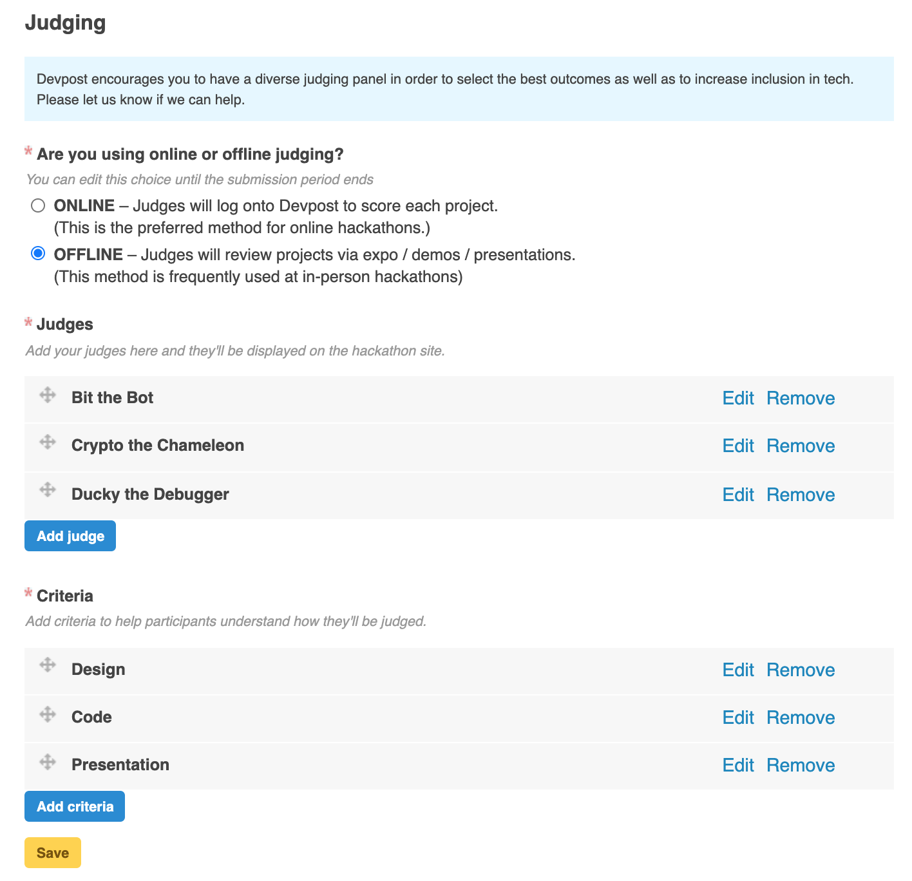

# Using Devpost

Setting up your Devpost digital hackathon page is much similar to how you will be setting up in-person hackathon and manage submissions, judging, and assigning winners. Since hosting Digital Hackathons is a paid service on Devpost, you need to contact their support for conversion of your in person hackathon into a digital one from their side. Devpost people are kind enough to provide their platform for free for any community/ student hackathons that might be happening around!

To create your hackathon page:

1. Sign into your Devpost account and hover over your profile image in the top right corner. Select "**Manage hackathons**".
2. On the next page you can view all the hackathons you have created. To create a new hackathon page click "**Post a new in-person hackathon**".
3. Once you enter the name of your hackathon and the date you want hackers to start submitting click "**Create my draft hackathon**".
4. From there, you can start filling out your draft hackathon page. Once you're ready to publish it to the world click the yellow "Publish" button in your hackathon dashboard.


If you ever have questions or need help using Devpost you can reach out to the Devpost team at [support@devpost.com](mailto:support@devpost.com).


## Submissions

When you are editing your hackathon on Devpost the Submissions section allows you to set the start date and deadline of the submission period for your hackathon. You’ll also be able to add final reminders and custom submission questions for your hackers.

## Judging on Devpost

Devpost has two different judging options:

**Online judging** allows you to have judges sign up for Devpost accounts, login, and review projects based on the judging criteria you set.

**Offline judging** allows you to run judging however you want. This can be through expos, demos, presentations, or any combination of other judging methods. Once hackers submit, you can export the submission data to a CSV file which will allow you to use it for your judging process.

To learn more about judging on Devpost you can visit their Judging [documentation](https://help.devpost.com/hc/en-us/sections/360003401091-Judging). Content coming soon ✨
