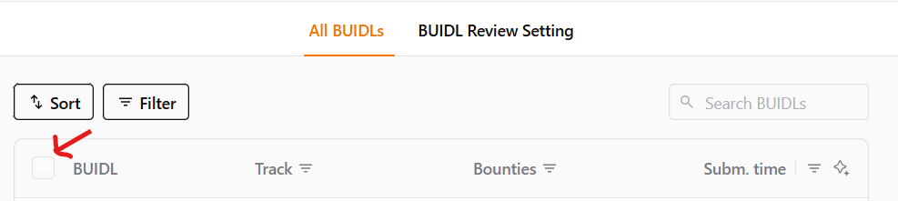
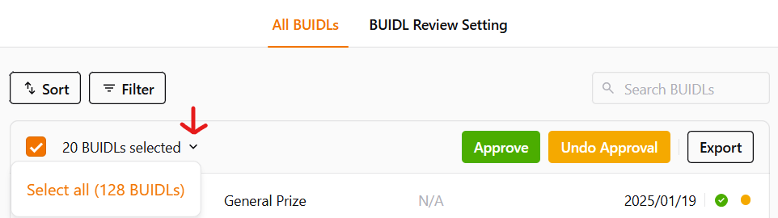

# Using DoraHacks


This platform does not currently meet [MLH export requirements](https://guide.mlh.io/general-information/judging-and-submissions/set-up-your-hackathon-portal), so you will have to manually add the missing fields or do a secondary form as a workaround.&#x20;


Setting up your DoraHacks hackathon page will help you manage your project submissions, judging, and assigning winners. Please follow this guide on [DoraHacks](https://dorahacks.io/blog/guides/diy-your-hackathon/) for step by step instructions.

If you decide to use DoraHacks and are applying to be an MLH member event, please ensure the following:

1. Reach out to your Hackathon Community Manager at MLH for help getting DoraHacks set up within the MLH requirements.&#x20;
2. Similar to Devfolio, DoraHacks has an approval process that your event needs to go through before you can publish it live. Make sure to work ahead of time to be approved so you can customize as needed.&#x20;
3. You need to create the hackathon as an organization. If you don’t have an organization yet, create one first. Please add league+dorahacks@mlh.io as an admin on your event so the Coach at your event can help onsite. You must add it to your "Organization" first.&#x20;
4. As the platform doesn’t support questions other than text type, we require you to use a platform, such as [OrganizerHQ](https://guide.mlh.io/general-information/managing-registrations/free-registration-tool-organizerhq-ohq) or others, that allow you to add [MLH mandated registration fields and checkboxes](https://guide.mlh.io/general-information/managing-registrations/registration-timelines#important-registration-fields) for registrations. DoraHacks has a field where you can enter this registration link, and disable registration on their platform.&#x20;

<figure><figcaption></figcaption></figure>

5. Please confirm that the submission requirements and rules for your event have been added correctly. [https://guide.mlh.io/general-information/judging-and-submissions/rules-for-your-hackathon](https://guide.mlh.io/general-information/judging-and-submissions/rules-for-your-hackathon)&#x20;
6. Add custom submission questions from Overview -> BUIDL submission tab. These currently do not support dropdowns or multiselect fields, so if you need data formatted a certain way make sure it is clear in the question how hackers should format their responses. It is limited to 1200 characters.
   1. Links or other information relevant to MLH category prizes they opt-in to. Example - domain name that the team redeemed if a domain partner was active at your event.&#x20;
   2. Share feedback about any technology you interacted with at this hackathon. Remember to mention what tech you're reviewing (e.g. MongoDB, GitHub, Auth0, etc.).&#x20;
   3.  Schools of all the team members (used in our Season competition).&#x20;

       <figure><figcaption></figcaption></figure>
7. DoraHacks project exports currently don’t include information such as project demo links and details of team members so make sure to practice exporting data from DoraHacks for judging. The platform does not currently meet [MLH export requirements](https://guide.mlh.io/general-information/judging-and-submissions/set-up-your-hackathon-portal), so you will have to manually add the missing fields or do a secondary form as a workaround.&#x20;
8. We also recommend adding a separate Rules tab for hackers. Check out our recommended rules list at [https://guide.mlh.io/general-information/judging-and-submissions/rules-for-your-hackathon](https://guide.mlh.io/general-information/judging-and-submissions/rules-for-your-hackathon)&#x20;
   1. There is no template for what to include in the project description. We recommend you add this to the rules section as an idea for those new to hackathons about what information to include

### Updates&#x20;

Here are some things our team noticed recently at events using DoraHacks that your organizing team would benefit from knowing. Please keep in mind we also talked with the DoraHacks team, so some of this may change in the future.&#x20;

* Only 10 users can be admin on a team account at once.&#x20;
  * Try getting a team email set up for your help desk so that anyone on your team can help hackers or sponsors as needed.&#x20;
* Many parts of the event are locked once the event starts. Please make sure your page is 100% ready a few days before the event. Teams cited a learning curve for setup, and you want to add buffer time to get help via email before the event starts. Make sure you have a specific contact to call if anything goes wrong over the weekend, as email may take longer to get a response outside of normal business hours.&#x20;
  * Events have had better success at timely communications when requiring DoraHacks representatives to join the event's Discord and set the expectation that they would be online for the judging period.&#x20;
  * Starting your DoraHacks page at least a month beforehand is recommended in order for the DoraHacks team to troubleshoot your setup ahead of time.
* Hackers cannot edit required questions after an initial submission is made. This is very different from other platforms, which more of your hackers are likely to be familiar with. We recommend adding a first question to state that they understand the following set of questions cannot be edited after initial submission.&#x20;
  * This includes the fields for each hacker's contact information that you need to have to meet MLH requirements, as if this is a required question, then hackers cannot edit it after their initial submission.
  * If you add a new question after a project/BUIDL is submitted, the new question will only appear on the new projects/BUIDLs (not on any who try to edit their application)
  * Hackers also cannot edit their project after being approved/verified.&#x20;
  * The default “GitHub url” question is forced set to optional, so you have to add an additional duplicate question set as required to force GitHub submissions.
* To add a sponsor/opt-in prize, you have to add the company under the bounties tab. After you have added the company, you have to go to the winner assignment tab and add the prizes under each company
  * **You cannot edit/delete prizes after the hackathon period has started.** The only fix is to move the hackathon start time back.
    * This is to prevent abuse/lowering of prize amount. Reach out to your DoraHacks representative via telegram/email/discord as needed and they can update on the backend.&#x20;
    * This means you should aim to have all sponsor prizes ready before your event start. If you wish to announce "surprise" challenges during opening ceremony, make sure someone on your team is ready to update and you push back your start time as needed to make sure they are accurate.&#x20;
* You cannot sort all submissions by the opt-in prize with the current export settings. To sort/export by opt-in prize, you have to go to the bounties tab and click on the sponsor/challenge. Schedule extra time to notify any sponsors or side challenges which teams they need to go judge.&#x20;
* When exporting submissions, you have to scroll and click “view more” until all projects are displayed, then click the select all checkbox, then export if you want to export all of the projects. If you do not click all of the view more buttons, you will not get a full export
  * You can only export: Project id, project name, project url, project last updated time, submission time, contact email, track, bounties (opt-ins), custom questions (a new column for any custom question added), and review status
  * Trick to select all - select all checkbox then do dropdown right next to actually select all - need to approve to be visible, there is no autoapprove and the gallery is always “on”

<figure><figcaption></figcaption></figure>

<figure><figcaption></figcaption></figure>

* We made an example export by [anonymizing a real one that you can view here](https://docs.google.com/spreadsheets/d/1IbdZ1fKyKmk60aYHrvpyxYcJBywgQ2RhOIUEzRpKvXY/edit?usp=sharing)
  * Please note the data is messy to reflect what it originally looked like. Hackers were inconsistent with how they formatted their answers to the questions, and we've purposefully left this as an example when anonymizing the export.&#x20;
* To export user information, you have to follow the same process as exporting submissions, but under the hacker tab. The only fields that are exportable are: hacker nickname, handle, url, GitHub, registration time, skills, interests, and onboarding status. **Note: THIS DOES NOT CONTAIN ANY CONTACT INFORMATION FOR PRIZE FULFILLMENT, PROJECT FOLLOWUP, ETC. As a reminder, this information should be included as required questions for your hackers.**
* Here is an example from [UofTHacks for a hacker guide](https://docs.google.com/document/d/1SGqy5dUess8S_Szf1GS4xRzL00JfB-NBzox_Xn3WpyI/edit?usp=sharing) for project submission editing. We highly recommend having a "Submit your hack" workshop Sunday morning&#x20;
  * The location of "Bounties" selection is confusing for some hackers, it is not part of the BUIDL flow. Users have to go back to the events' DoraHacks page to select and submit. Multiple teams encountered this issue during submissions previously.&#x20;
  * Hackers have shown confusion of if Telegram is required. While it is written that it is optional, we recommend restating that they can put N/A.&#x20;
* The deadline extension feature can only be used once.&#x20;
* We recommend using Bounties instead of Tracks, as you currently cannot add a description of the prize for tracks.&#x20;

