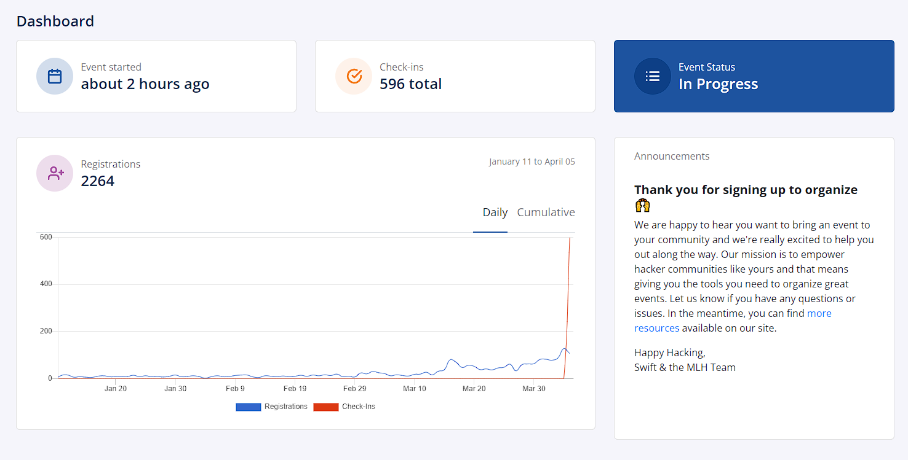

# Free Registration Tool - OrganizerHQ (OHQ)

Typeform or Google Forms costing you money due to your event size? Worried about hackers trying to steal your data if you build your own platform? Want quick setup of registrations so you can make your registration live quickly?

Some perks of OHQ:

* It is free!
* OHQ automatically has all the required MLH fields
  * This has the added benefit of being faster for hackers to register if they have an MLH account already
* You can add custom questions of your own
* You can also use the dashboard to see how marketing efforts are going
* You can export the data at any time
* Update the image and descriptions to point back to your website
* Use it for easy checkin &#x20;
* You can add anyone on your team so they can help you manage it

Reach out to league@mlh.io for help getting this set up for your event or if you have any further questions. You can also be added as a team member on the example event if you would like to test it out!

Let's see some screenshots

### Dashboard

Check in on how marketing is going! You can see spikes in registrations to see what is working best for marketing. You can also use it day of to keep track of how many attendees have checked in.&#x20;

<figure><figcaption>
An example from Globabl Hack Week Signups
</figcaption></figure>

### Easy Export and Custom Question Functionality

You can see hackers who register, add new attendees manually (if you need to add someone new the day of your event at check-in for example), and utilize this page for Rejections and Checking in Hackers. You can export your registrations at any time using the Export button, which emails you a .csv of the hackers.&#x20;

<figure><figcaption>
See who has registered for your event on the registrations page
</figcaption></figure>

If a hacker already has an account(from attending another event or participating in Global Hack Week), they only have to answer additional questions you can see in the question tab on this example event. You can see all the information for them when they register for your event. You can also add your own questions.&#x20;

<figure><figcaption>
These are the only questions an existing user would answer. You can add your own event specific questions up top!
</figcaption></figure>

This next preview is of the example export. It will include all registrants in the same file, but for privacy reason we only included 1 example registration with mock data.&#x20;


Example Export with MLH Required Fields not shown in the questions tab already included!


