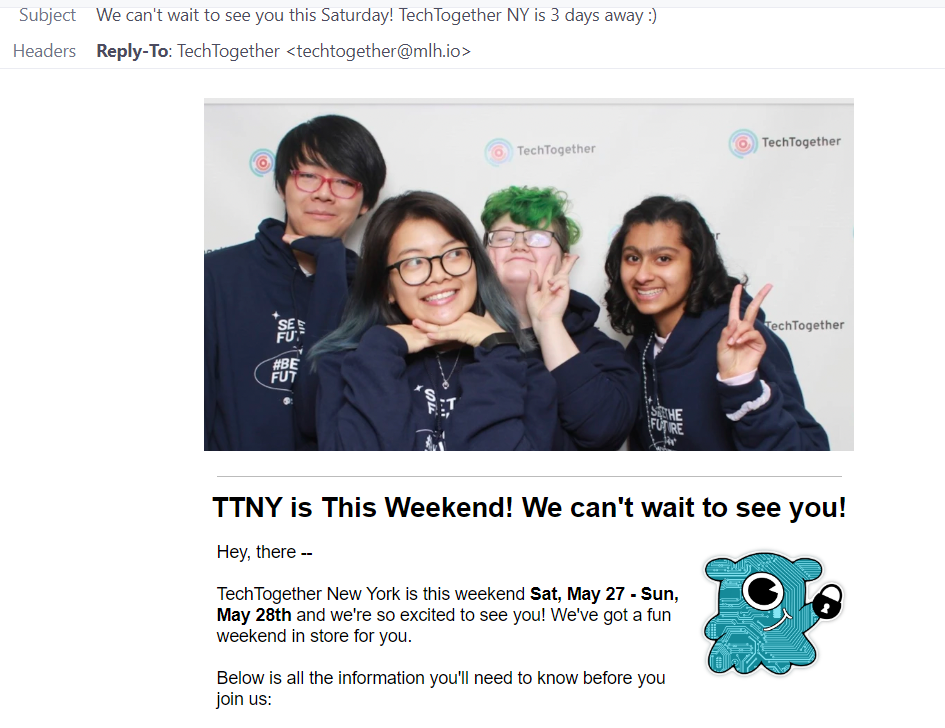
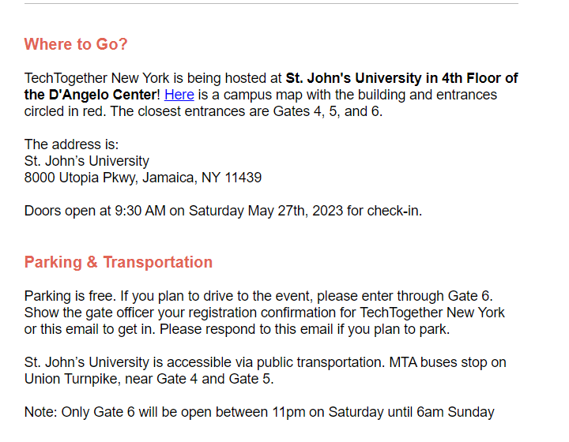
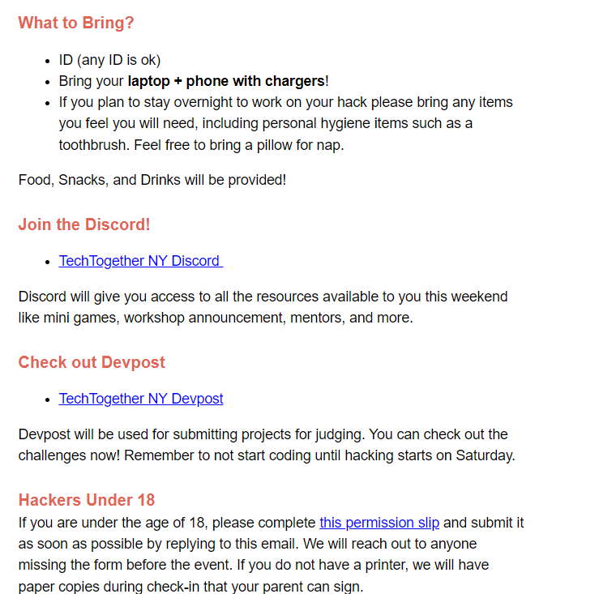

# Email Templates

Here is an example email for the week before your event. Remember to adjust timings for volunteers, judges, sponsors, etc.&#x20;

<figure><figcaption>
Start with a clear summary.
</figcaption></figure>

<figure><figcaption>
Include where to go and when they should arrive.
</figcaption></figure>

<figure><figcaption>
Include what to bring and some important links where they can get help. 
</figcaption></figure>

<figure><figcaption>
If you are still accepting registrations link it so they can bring their friends! Remember to sign off with why they are receiving the email so they don't mark it as spam. 
</figcaption></figure>
