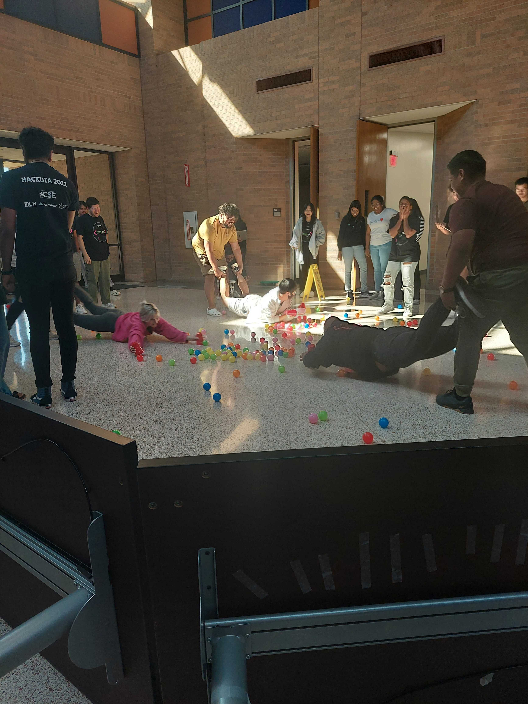
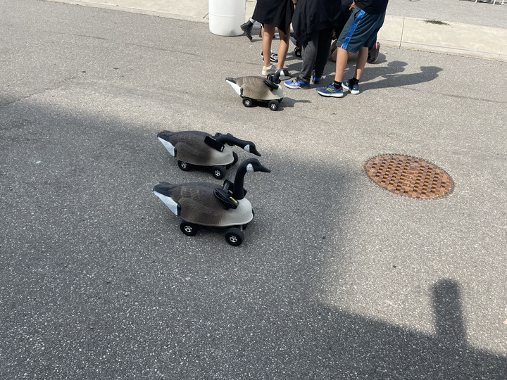

# Host Exciting Mini-Events

Some examples of mini-events at events we have partnered with. They vary in cost, and some are easier than others to host. Ask clubs on campus if they can help out to keep costs low!

* Cookie decorating
* Scavenger Hunt
* Smash Tournament
* Paper Airplane Competition
* Tetris Tournament- tetr.io
* Jackbox Games-Make sure you are in family friendly mode
* Life Size Hungry Hungry Hippos- do you remember the little scooters from elementary school?
* RV race (for a bonus add geese on top)
* Smores- only if you have a firepit nearby on campus already available
* Ice Skating on a nearby frozen canal
* Watch the sunset/sunrise if you have a tall venue
* Lego break
* Dog visits
* Yoga
* Giant Chess
* Board Game break area
* Life Size Pacman

<figure><figcaption>
HackUTA Hungry Hungry Hippos
</figcaption></figure>

<figure><figcaption>
A Canadian Event's (RV) Goose Race
</figcaption></figure>

You can also learn more about MLH Mini-events options you can choose from that your MLH representative will host (or if you want multiple how to host yourselves) in the subpages below.&#x20;
